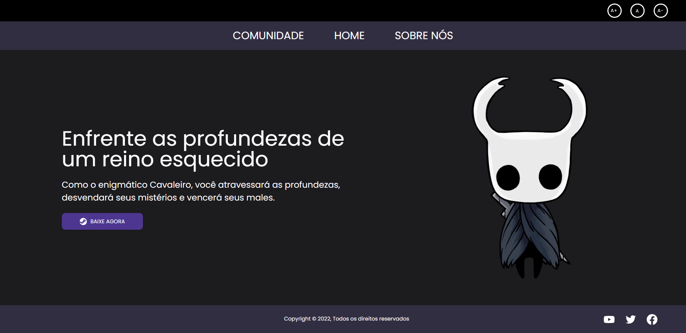

  
    

<h1 align="center">Hollow Knight Fansite</h1> 

  

💻 **Acesse o site [aqui](https://hollow-knight-fansite.vercel.app/)** | 

  

## 📑 Índice

- [Sobre o Projeto](#-sobre-o-projeto)
- [Tecnologias utilizadas](#-tecnologias-utilizadas)
- [Executar na sua máquina](#-executar-na-sua-máquina)
- [Licença](#-licença)
  
## 💡 Sobre o Projeto

O desenvolvimento deste site foi proposto com o principal objetivo de implementar recursos de acessibilidade e reforçar os conhecimentos de HTML, CSS e JS.

Esse projeto foi realizado durante o programa de mentoria de desenvolvimento da [Dell Lead](https://leadfortaleza.com.br/portal).
 

## 🚀 Tecnologias utilizadas

O projeto foi desenvolvido utilizando as seguintes tecnologias:

- JavaScript
- HTML5 e CSS3

  

## 📥 Executar na sua máquina

- Clonar Repositório: `git clone https://github.com/n1ghtr1der/hollow-knight-fansite.git`

 

## 📕 Licença
Criado por [Emirton Sousa](https://github.com/n1ghtr1der)
